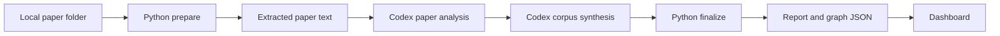

<h1 align="center">One Summary to Rule Them All</h1>

<p align="center">
  <strong>From a folder of papers to a literature map, research gaps, publishable ideas, and an interactive dashboard.</strong>
  <br />
  <em>A Codex-powered research copilot for turning many papers into one actionable research map.</em>
</p>

<p align="center">
  <a href="#quick-start"></a>
  <a href="#manual-cli-workflow"></a>
  <a href="#dashboard"></a>
  <a href="#how-it-works"></a>
</p>

---

You have a folder of papers. You want to know what the papers are about, which research areas are mainstream, which methods appear frequently, what gaps are underexplored, and what publishable ideas may be worth trying.

One Summary to Rule Them All is built for that workflow. It separates deterministic file processing from semantic research analysis:

- **Python** scans local papers, extracts text, prepares batches, validates JSON, builds the report, and serves the dashboard.
- **Codex** reads extracted paper text, analyzes each paper, synthesizes cross-paper trends, and proposes research ideas.
- **Dashboard** presents the result as overview cards, method matrices, paper summaries, gaps, ideas, and graph exploration.

The Python package does not call external model APIs. The active Codex session is the semantic analyzer.

## Features

### One-prompt Codex workflow

Ask Codex to run the skill against your paper folder. Codex prepares the corpus, analyzes pending papers, synthesizes trends, finalizes artifacts, starts the dashboard, and opens the local page.

Example prompt:

```text
Use this skill to study all papers under D:\papers, generate the literature analysis, and open the dashboard.
```

Chinese prompt example:

```text
用这个 skill 帮我研究 D:\文献 目录下的所有论文，生成分析结果并打开 dashboard。
```

### Literature-review outputs

The workflow produces:

- per-paper problem, core idea, methods, innovations, limitations, and future work
- broad research directions such as `image-retrieval`, `medical-imaging`, or `person-re-identification`
- reusable method themes such as contrastive learning, hashing, distillation, pseudo-labeling, and attention
- mainstream, emerging, and underexplored direction signals
- research gaps with evidence and risk
- methodology suggestions with candidate methods and experiment sketches

### Dashboard-first review

The dashboard is the preferred final reading surface. It includes:

- **Overview**: corpus stats, mainstream areas, hot methods, underexplored areas
- **Method Matrix**: research area by method-theme heat map
- **Papers**: readable per-paper summaries
- **Gaps**: underexplored problems and supporting evidence
- **Ideas**: methodology suggestions and experiment sketches
- **Graph Explore**: interactive relationship graph for deeper inspection

## Quick Start

### Option A: Let Codex run the whole pipeline

Use this when you want the assistant experience.

1. Open this repository in Codex.
2. Ask Codex:

   ```text
   Use this skill to study all papers under D:\papers, generate the literature analysis, and open the dashboard.
   ```

3. Codex will run the workflow:

   ```text
   prepare papers
     -> analyze pending paper batches
     -> synthesize corpus trends and gaps
     -> finalize graph and report
     -> start dashboard
     -> open the local dashboard page
   ```

This is the intended skill mode. You do not manually edit intermediate JSON files in this path; Codex writes them as part of the analysis.

### Option B: Run the CLI step by step

Use this when you want full control over each stage, or when you want to inspect intermediate files.

```powershell
cd D:\project\paper-research-assistant
python -m paper_research_assistant prepare D:\papers
```

Then inspect:

```text
D:\papers\.paper-research-assistant\intermediate\analysis-batches.json
```

For each batch, create:

```text
D:\papers\.paper-research-assistant\intermediate\paper-analysis-<N>.json
```

After all paper-analysis files exist, create the cross-paper synthesis:

```text
D:\papers\.paper-research-assistant\intermediate\corpus-analysis.json
```

Finalize:

```powershell
python -m paper_research_assistant finalize D:\papers
```

Open the dashboard:

```powershell
python -m paper_research_assistant dashboard D:\papers
```

The manual mode is intentionally separate from the Codex automatic mode. In manual mode, the CLI prepares and finalizes deterministic artifacts, but a human or host model must still write the semantic analysis JSON files.

## Installation

Install the package in editable mode from this repository:

```powershell
cd D:\project\paper-research-assistant
python -m pip install -e .
```

Install one PDF text extraction backend:

```powershell
python -m pip install pymupdf
```

or:

```powershell
python -m pip install pypdf
```

The dashboard requires Node.js with npm. The dashboard command installs frontend dependencies when needed.

## Manual CLI Workflow

### 1. Prepare

```powershell
python -m paper_research_assistant prepare D:\papers
```

Responsibilities:

- scan `.pdf`, `.txt`, and `.md` files
- compute file hashes
- extract paper text
- split common sections
- create `papers.json`
- create `paper-text/*.json`
- create `intermediate/analysis-batches.json`
- skip unchanged papers that already have matching analysis

Use `--force` only when the text extraction cache should be regenerated:

```powershell
python -m paper_research_assistant prepare D:\papers --force
```

### 2. Analyze paper batches

Read the batch manifest:

```text
D:\papers\.paper-research-assistant\intermediate\analysis-batches.json
```

Write one JSON file per batch:

```text
paper-analysis-1.json
paper-analysis-2.json
...
```

The contract is defined in:

```text
agents/paper-analyzer.md
```

Directions should be broad research areas or tasks. Methods should be reusable technical approaches.

### 3. Synthesize the corpus

After all paper batches are analyzed, write:

```text
D:\papers\.paper-research-assistant\intermediate\corpus-analysis.json
```

The contract is defined in:

```text
agents/corpus-synthesizer.md
```

This file contains mainstream directions, emerging directions, underexplored gaps, and method innovation suggestions.

### 4. Finalize

```powershell
python -m paper_research_assistant finalize D:\papers
```

This creates:

```text
D:\papers\.paper-research-assistant\
  analysis.json
  literature-graph.json
  research-map-report.md
  run-summary.json
```

### 5. Open the dashboard

```powershell
python -m paper_research_assistant dashboard D:\papers
```

By default, the dashboard runs at:

```text
http://127.0.0.1:5179
```

Use a different port if needed:

```powershell
python -m paper_research_assistant dashboard D:\papers --port 5181
```

## Dashboard

The dashboard reads three generated files:

```text
literature-graph.json
analysis.json
research-map-report.md
```

It is read-only. The source of truth remains the generated files in:

```text
<paper-folder>\.paper-research-assistant\
```

## Outputs

Default output directory:

```text
<paper-folder>\.paper-research-assistant\
```

Important files:

| File | Purpose |
|---|---|
| `papers.json` | scanned paper manifest |
| `paper-text/*.json` | extracted text and sections |
| `intermediate/analysis-batches.json` | pending paper batches for Codex or manual analysis |
| `intermediate/paper-analysis-<N>.json` | per-paper semantic analysis |
| `intermediate/corpus-analysis.json` | cross-paper trend and gap synthesis |
| `analysis.json` | merged semantic analysis |
| `literature-graph.json` | dashboard-ready graph and insight data |
| `research-map-report.md` | human-readable research map report |
| `run-summary.json` | run status and output paths |

## How It Works



The split is deliberate:

- deterministic work stays in Python
- research judgment stays in Codex
- JSON artifacts keep the workflow inspectable and repeatable
- cached hashes prevent unchanged papers from being re-read

## Local Smoke Test

This command verifies the deterministic pipeline without Codex semantic analysis:

```powershell
python -m paper_research_assistant analyze D:\papers
```

It uses heuristic extraction only. Treat its research gaps and methodology suggestions as smoke-test signals, not as final literature-review claims.

## Repository Layout

```text
agents/                    host-model analysis contracts
dashboard/                 React/Vite dashboard
docs/                      workflow documentation
paper_research_assistant/  Python package and CLI
SKILL.md                   Codex skill instructions
```

## Notes

- Do not manually read raw PDF files in the model context. Run `prepare` first and analyze `paper-text/*.json`.
- Do not re-read cached papers. `analysis-batches.json` is the authority for pending work.
- The Python package does not call OpenAI, Anthropic, or other model APIs.
- The graph shows local-corpus signals. With a small paper set, treat "mainstream" as mainstream within the provided corpus, not necessarily the whole research field.
